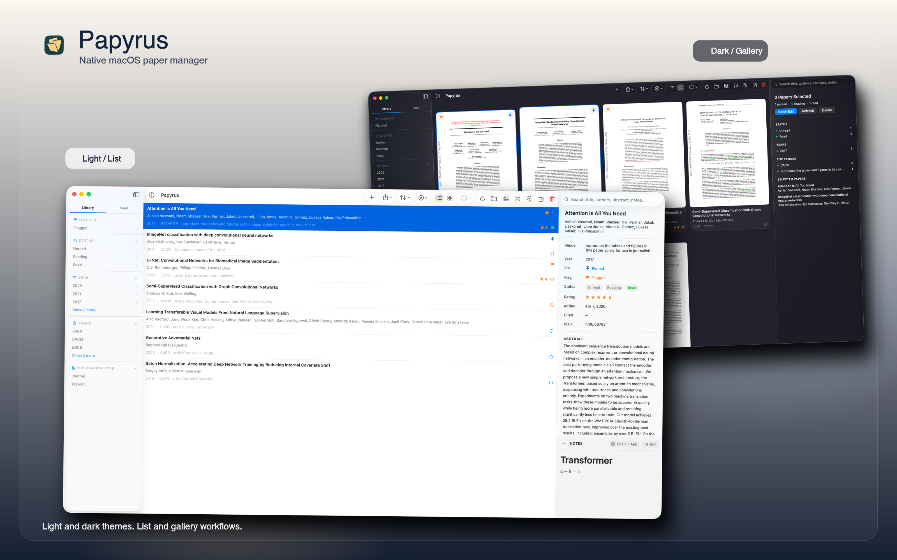

<p align="center">
  
</p>

<h1 align="center">Papyrus</h1>

<h4 align="center">A fully vibe-coded native macOS paper manager for researchers.</h4>

<p align="center">
  Local-first paper library with list and gallery views, built-in web clipping, and a scriptable CLI.
</p>

<p align="center">
  <a href="https://github.com/liiuhaao/Papyrus/releases">
    
  </a>
  
  <a href="https://github.com/liiuhaao/Papyrus/blob/main/LICENSE">
    
  </a>
</p>

<p align="center">
  <a href="#features">Features</a>
  ·
  <a href="#install">Install</a>
  ·
  <a href="#web-clipper">Web Clipper</a>
  ·
  <a href="#cli">CLI</a>
</p>

<p align="center">
  
</p>

`Papyrus` is a fully vibe-coded native macOS app for collecting, organizing, and revisiting research papers. It keeps your files and metadata on your machine, supports both dense list management and visual gallery browsing, and pairs the desktop app with a browser clipper and bundled `papyrus` CLI.

## Features

- **Local-first** — all files, notes, and metadata stay on your machine
- **List & Gallery views** for different library browsing workflows
- **Light & Dark themes** with native macOS appearance
- **Smart organization** — tags, ratings, flags, pins, and reading states for paper triage
- **Multi-source metadata** — Semantic Scholar, CrossRef, OpenAlex, OpenReview, DBLP with extraction, refresh, and cleanup
- **Web Clipper** (Safari & Chrome) — one-click PDF saves, supports paywalled sources
- **RSS/Atom feeds** — subscribe to conferences and journals for paper discovery
- **Built-in CLI** — `papyrus` command with JSON output for automation and vibe-coding workflows

## Install

1. Download `Papyrus.dmg` from [Releases](https://github.com/liiuhaao/Papyrus/releases)
2. Drag `Papyrus.app` into **Applications**
3. Launch Papyrus — the bundled `papyrus` CLI is installed automatically
4. If macOS blocks Papyrus, go to `System Settings -> Privacy & Security` and click `Open Anyway`

## Web Clipper

Papyrus ships with a browser extension for saving papers directly to your library.

- **Safari** — enable the Papyrus Web Clipper extension in Safari → Settings → Extensions
- **Chrome** — install the companion Chrome extension (included in the release)

The clipper works behind paywalls: it captures the PDF from your authenticated browser session.

## CLI

The `papyrus` CLI exposes your library for scripting and automation.

```bash
papyrus list                    # list all papers
papyrus list --tag "diffusion"  # filter by tag
papyrus show <id>               # show paper details (JSON)
papyrus help                    # full command reference
```

## Acknowledgements

Built with Swift and SwiftUI, with help from
<a href="https://openai.com/codex/"><strong>Codex</strong></a> and
<a href="https://www.anthropic.com/claude-code"><strong>Claude Code</strong></a>,
and inspired by
<a href="https://www.zotero.org/"><strong>Zotero</strong></a> and
<a href="https://paperlib.app/"><strong>Paperlib</strong></a>.